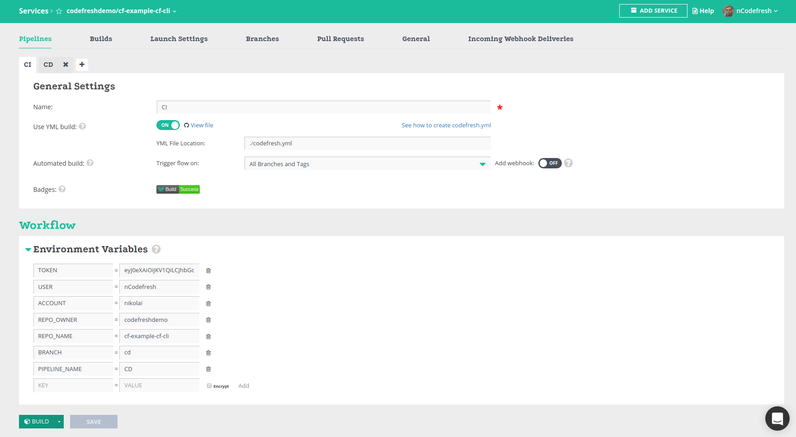

# Welcome

So, you've decided to try Codefresh? Welcome on board!

Using this repository we'll help you get up to speed with basic functionality such as: *compiling*, *testing* and *building Docker images*.

This project uses `Node Js` to build an application which will eventually become a distributable Docker image.

## Looking around

In the root of this repository you'll find a file named `codefresh.yml`, this is our [build descriptor](https://docs.codefresh.io/docs/what-is-the-codefresh-yaml) and it describes the different steps that comprise our process.
Let's quickly review the contents of this file:

### Compiling and testing

To compile and test our code we use Codefresh's [Freestyle step](https://docs.codefresh.io/docs/steps#section-freestyle).

The Freestyle step basically let's you say "Hey, Codefresh! Here's a Docker image. Create a new container and run these commands for me, will ya?"

```yml
cf-cli-step:
    image: node:latest
    commands:
      - npm install -g @codefresh-io/cf-cli
      - cf-cli login --token ${{TOKEN}} -u ${{USER}}
      - cf-cli builds build -a ${{ACCOUNT}} -o ${{REPO_OWNER}} -r ${{REPO_NAME}} --branch ${{BRANCH}} --pipelineName ${{PIPELINE_NAME}}
```

The `image` field states which image should be used when creating the container (Similar to Travis CI's `language` or circleci`s `machine`).

The `commands` field is how you specify all the commands that you'd like to execute

# Codefresh command line manager
This package provides a unified command line interface to Codefresh.

## Installation

```
$ npm install -g @codefresh-io/cf-cli
```

## Compositions

```
$ cf-cli compositions <sub-command> [options]
```

| Sub-command | Description |
| ----------- |:-----------|
| ls     | list of compositions |
| create | create a new composition |
| remove | delete composition |
| run    | launch a composition |

```
$ cf-cli compositions ls [options]
```

| Option         | Alias | Demand | Type | Description |
| ----------------  |:-----:|:------:|:----:|:-----------|
| --token          |       |          | string | access token |
| --tofile         |       |          | string | save result to file |
| --table          |       |          | boolean | output as table to console |
| --tokenFile      |       |          | string | access token file, default: "$HOME.codefresh/accessToken.json" |
| --logLevel       | --log |          | string | choices: "error", "info", "debug"; default: "error" |
| --help           | -h    |          | boolean | show list of options for command |

```
$ cf-cli compositions create [options]
```

| Option         | Alias | Demand | Type | Description |
| ----------------  |:-----:|:------:|:----:|:-----------|
| --token          |       |          | string | access token |
| --tofile         |       |          | string | save result to file |
| --file           |       | required | string | path to <file>.json. Content of the file in the format {"isAdvanced":false,"vars":[{"key":"test_key","value":"test_value"}],"yamlJson":"path to your composition.yml","name":"string"} |
| --tokenFile      |       |          | string | access token file, default: "$HOME.codefresh/accessToken.json" |
| --logLevel       | --log |          | string | choices: "error", "info", "debug"; default: "error" |
| --help           | -h    |          | boolean | show list of options for command |

```
$ cf-cli compositions remove [options]
```

| Option         | Alias | Demand | Type | Description |
| ----------------  |:-----:|:------:|:----:|:-----------|
| --token          |       |          | string | access token |
| --id             |       | required | string | id of composition |
| --tokenFile      |       |          | string | access token file, default: "$HOME.codefresh/accessToken.json" |
| --logLevel       | --log |          | string | choices: "error", "info", "debug"; default: "error" |
| --help           | -h    |          | boolean | show list of options for command |

```
$ cf-cli compositions run [options]
```

| Option         | Alias | Demand | Type | Description |
| ----------------  |:-----:|:------:|:----:|:-----------|
| --token          |       |          | string | access token |
| --id             |       | required | string | id of composition |
| --vars           |       |          | string | composition variables. Format [{"key":"","value":""}]; default: [] |
| --tokenFile      |       |          | string | access token file, default: "$HOME.codefresh/accessToken.json" |
| --logLevel       | --log |          | string | choices: "error", "info", "debug"; default: "error" |
| --help           | -h    |          | boolean | show list of options for command |


## Using This Example

To use this example:

* Fork this repository to your own [INSERT_SCM_SYSTEM (git, bitbucket)] account.
* Log in to Codefresh using your [INSERT_SCM_SYSTEM (git, bitbucket)] account.
* Click the `Add Service` button.
* Select the forked repository.
* Select the `I have a Codefresh.yml file` option.
* Complete the wizard.
* Go to the pipeline and provide the environment variables
* Rejoice!

<p align="center">
  
</p>